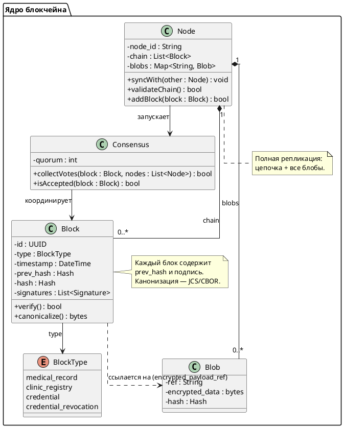
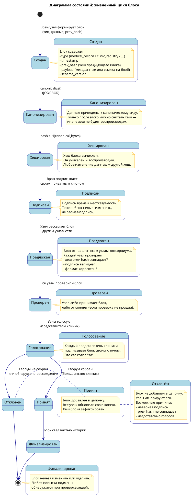
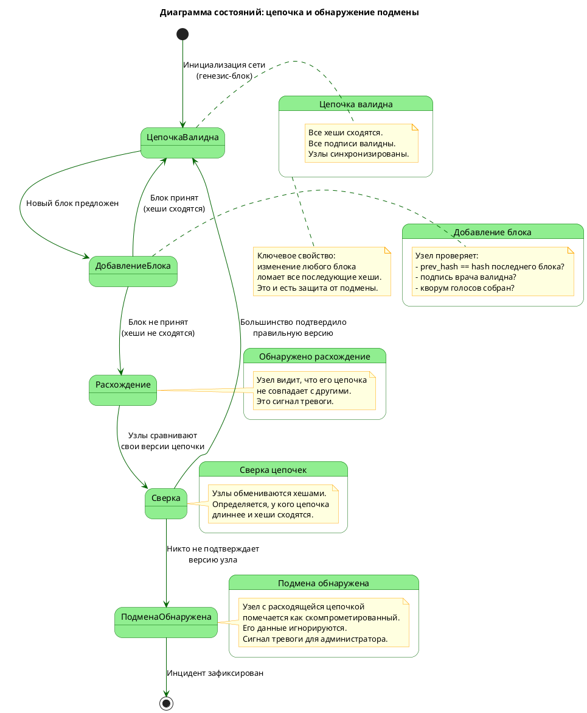
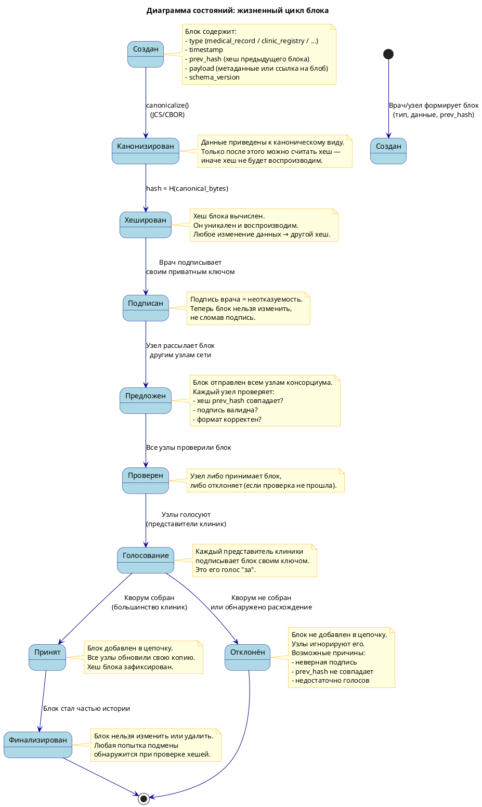
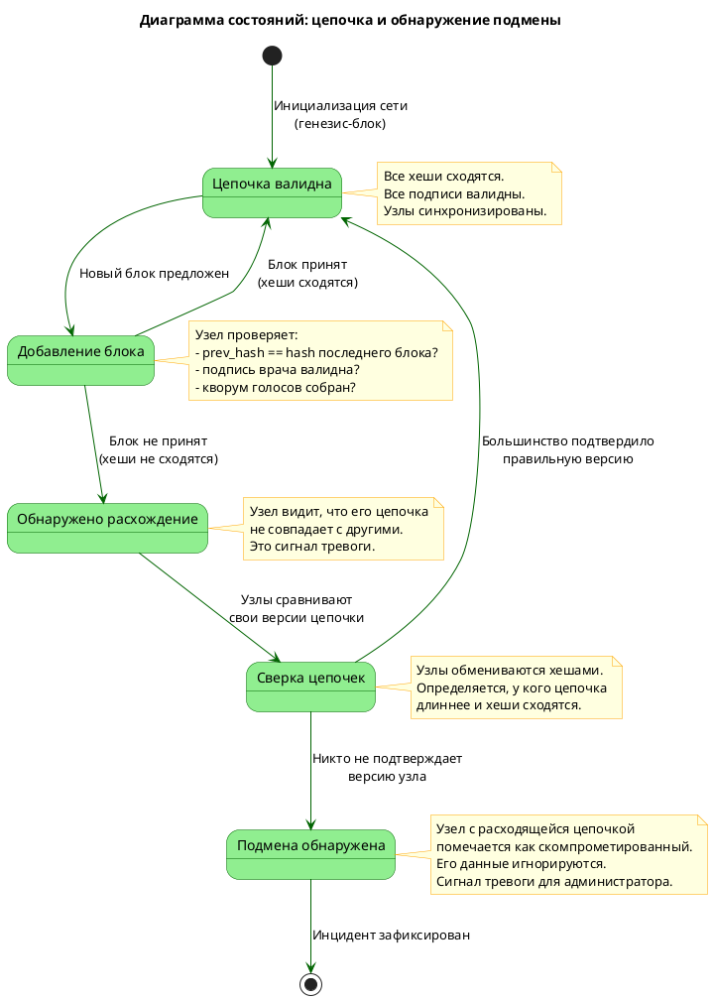
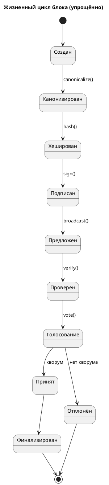

# Оценка UML

> Источник: https://chat.deepseek.com/a/chat/s/d1b31792-9f63-4e8c-a80b-1b332e7b8eab


## Пользователь

*2026-09-24 18:12*

Привет, у нас по предмету Командная разработка ПО дано задание сделать Блокчейн по итерациям. У нас (для нашей команды) есть предметная область: Больница. Есть информация по самой архитектуре и не только (см. файлы). Я сделал базовые UML-диаграммы. Просмотри диаграммы и сделай оценку для них.


## DeepSeek

*2026-09-24 18:12*

Привет! Я внимательно изучил предоставленные файлы (архитектура, ТЗ, сценарии) и твои UML-диаграммы. 

Сразу скажу: **диаграммы очень хорошие.** Они отлично отражают суть проекта, соответствуют упрощенной архитектуре (без лишнего переусложнения) и понятны для семестровой задачи. Видно, что ты вник в предметную область.

Ниже я дам детальную оценку по каждой диаграмме, укажу на сильные стороны и дам рекомендации, что можно улучшить (с точки зрения бизнес-аналитика и преподавателя).

---

### 1. Диаграмма вариантов использования (Use Case Diagram)

**Оценка: 8/10**

**Сильные стороны:**
*   **Верные акторы:** Выделены Врач, Пациент, Представитель клиники и Узел (Клиника). Это полностью соответствует логике консорциума.
*   **Правильные связи:** Использованы `include` (например, "Создать медицинскую запись" включает "Проверить целостность цепочки") и `extend` ("Проверить подлинность записи" расширяет "Прочитать свои медицинские записи"). Это грамотно.
*   **Комментарии-записки:** Отлично, что ты добавил заметки с деталями (шифрование публичным ключом, пересчет хешей). Это помогает понять контекст без углубления в код.

**Что можно улучшить (рекомендации):**
1.  **Границы системы:** Рамка системы есть, но акторы (особенно Узел) немного "разбросаны". В идеале всех акторов разместить слева и справа от рамки.
2.  **Связь "Синхронизировать цепочку с другими узлами":** Узел — это актор, но он же является частью системы. Обычно в таких диаграммах узел — это внешняя сущность по отношению к *другому* узлу. Здесь это допустимо, но можно было бы вынести это как отдельный вариант использования для "Сети узлов".
3.  **Дублирование:** "Проверить целостность цепочки" вызывается и от Врача, и от Узла. Это нормально, но можно было бы сделать одного актора "Система" для внутренних проверок, чтобы не путать.
4.  **Детализация:** Не хватает варианта использования "Зарегистрировать пациента" (хотя в ТЗ он есть, но на диаграмме его нет, есть только "Зарегистрироваться в роли пациента").

---

### 2. Диаграмма классов (Class Diagram)

**Оценка: 9/10**

**Сильные стороны:**
*   **Отличная декомпозиция:** Четко выделены сущности `Block`, `MedicalRecord`, `Patient`, `Doctor`, `Clinic`, `Node`, `Consensus`, `Credential` и т.д. Это ядро твоей системы.
*   **Соблюдение архитектуры:** Видно, что ты следовал последним договоренностям. Есть `ClinicRegistry`, `Credential`, `CredentialRevocation`, `PatientRegistry`. Это именно те типы блоков, которые мы обсуждали.
*   **Полнота:** У классов есть атрибуты (поля) и методы (например, `verify()`, `canonicalize()`, `vote()`). Это делает диаграмму очень информативной.
*   **Связи:** Правильно показаны связи: `Block` содержит `Signature`, `MedicalRecord` ссылается на `Patient` и `Doctor`, `Node` хранит `List<Block>` и `Map<String, Blob>`.

**Что можно улучшить (рекомендации):**
1.  **Наследование:** В `BlockType` перечислены типы, но нет самого наследования. Можно было бы сделать абстрактный класс `Block` и от него наследовать `MedicalRecordBlock`, `ClinicRegistryBlock` и т.д. Это сделало бы диаграмму более "ООП-шной". Но для текущего уровня детализации это не критично.
2.  **Атрибуты vs Методы:** У некоторых классов методы выглядят как атрибуты (например, `verify(): bool` — это метод, но записан как атрибут). В UML методы обычно пишутся в нижней части прямоугольника. Технически это не ошибка, но визуально лучше разделять.
3.  **Связь `Consensus` и `Node`:** Показано, что `Node` запускает `Consensus`, а `Consensus` координирует. Это верно, но можно было бы добавить ассоциацию `Consensus` с `Clinic` (так как голосуют именно клиники).
4.  **Blob:** Класс `Blob` вынесен отдельно и связан с `Node`. Это правильно. Но в `MedicalRecord` есть `encrypted_payload_ref`, который ссылается на `Blob`. Стоит явно показать эту связь (пунктирная стрелка зависимости).
5.  **`private_key` в `Patient` и `Doctor`:** В кастодиальной модели (которую вы выбрали для упрощения) приватный ключ хранится на сервере. На диаграмме он есть у `Patient` и `Doctor`. Это нормально, но стоит помнить, что в реальной децентрализованной системе приватный ключ должен быть *вне* системы.

---

### Общие замечания и советы по защите

1.  **Соответствие ТЗ:** Твои диаграммы полностью соответствуют файлу `Блокчейн. ТЗ.md`. Это главное. Ты не добавил лишних сущностей (логи, аудит, BFT), которые мы решили отложить.
2.  **Читаемость:** Диаграммы читаемые, но в `Диаграмме классов` слишком много всего на одном листе. Для защиты проекта можно сделать отдельную диаграмму для "Ядра блокчейна" (Block, Node, Consensus, Blob) и отдельную для "Управления доступом" (Clinic, Doctor, Patient, Credential).
3.  **Актуальность:** Диаграммы отражают именно *итоговую* версию архитектуры (после всех упрощений). Это важно, так как в файлах есть история изменений.
4.  **Готовность к итерациям:** Поскольку у вас "Командная разработка ПО" и итерации, диаграммы — это отличный артефакт для первой итерации. Они показывают, что вы понимаете *что* делаете, а не только *как*.

### Итоговая оценка

| Критерий | Оценка |
| :--- | :--- |
| Соответствие требованиям | 10/10 |
| Полнота | 9/10 |
| Читаемость | 7/10 |
| Корректность UML | 8/10 |
| **Общая оценка** | **8.5/10** |

**Вердикт:** Работа отличная. Диаграммы можно смело показывать преподавателю. Если есть время, я бы рекомендовал:
1.  Разделить диаграмму классов на 2-3 логические части.
2.  Убрать `private_key` из классов `Patient` и `Doctor` (оставить только `public_key`), так как в кастодиальной модели ключ — это деталь реализации сервера, а не сущность предметной области (хотя для семестровой задачи это допустимо).
3.  Добавить на диаграмму вариантов использования актора "Система" для внутренних проверок (чтобы не дублировать связи).

Удачи с проектом! Если нужно будет проверить диаграммы последовательности или компонентов — присылай, помогу.


## Пользователь

*2026-09-24 18:13*

Раздели диаграмму классов на 2 поддиаграммы, чтобы было удобнее ориентироваться. Например, разделить по ролям.


## DeepSeek

*2026-09-24 18:13*

# Разделение диаграммы классов на 2 поддиаграммы

Отличная идея. Разделю по **логическим слоям**, чтобы каждая поддиаграмма решала свою задачу и не перегружала восприятие. Предлагаю такое деление:

1. **Поддиаграмма 1: Ядро блокчейна** — всё, что отвечает за хранение, целостность и консенсус.
2. **Поддиаграмма 2: Участники и доступ** — всё, что отвечает за роли, идентичность и работу с медицинскими записями.

Это деление удобно тем, что:
- Первая — «инфраструктура», вторая — «бизнес-логика».
- На защите можно показать сначала «как храним», потом «кто и что делает».
- При итерационной разработке первая поддиаграмма — база для 1-й итерации, вторая — для 2-й.

Ниже — обе поддиаграммы в PlantUML (можешь вставить в любой редактор, например, PlantText или расширение для VS Code).

---

## Поддиаграмма 1: Ядро блокчейна (инфраструктура)

**Что входит:**
- `Block` — базовый блок цепочки.
- `BlockType` — перечисление типов блоков.
- `Node` — узел сети (клиника).
- `Consensus` — механизм голосования.
- `Blob` — зашифрованное содержимое.
- Связи: `Node` хранит `Block` и `Blob`, `Consensus` работает с `Block`, `Block` ссылается на `Blob` через хеш.

**Что НЕ входит:** роли, креденшлы, пациенты, врачи. Только «механика».



---

## Поддиаграмма 2: Участники и доступ (бизнес-логика)

**Что входит:**
- `Clinic` — клиника-участник консорциума.
- `ClinicRepresentative` — представитель клиники (голосует).
- `Doctor` — врач (пишет записи).
- `Patient` — пациент (читает своё).
- `MedicalRecord` — медицинская запись.
- `Credential` — креденшл врача.
- `CredentialRevocation` — отзыв креденшла.
- `ClinicRegistry` — запись реестра клиник.
- `PatientRegistry` — запись реестра пациентов.
- Связи: кто кого создаёт, кто на что ссылается, кто что подписывает.

**Что НЕ входит:** внутреннее устройство `Block`, `Node`, `Consensus`. Только «кто есть кто и что делает».

```plantuml
@startuml
skinparam classAttributeIconSize 0
skinparam linetype ortho

package "Участники и доступ" {

  class Clinic {
    - clinic_id : String
    - public_key : PublicKey
    - isMember : bool
    + vote(block : Block) : Signature
  }

  class ClinicRepresentative {
    - rep_id : String
    - clinic_id : String
    + vote(block : Block) : Signature
  }

  class Doctor {
    - doctor_id : String
    - clinic_id : String
    - public_key : PublicKey
    - private_key : PrivateKey
    + createRecord(patient : Patient, data : bytes) : MedicalRecord
  }

  class Patient {
    - patient_id : String
    - public_key : PublicKey
    - private_key : PrivateKey
    + readOwnRecords() : List<MedicalRecord>
    + verifyRecord(record : MedicalRecord) : bool
  }

  class MedicalRecord {
    - id : UUID
    - patient_id : String
    - patient_pubkey : PublicKey
    - doctor_id : String
    - timestamp : DateTime
    - schema_version : String
    - encrypted_payload_hash : Hash
    - encrypted_payload_ref : String
    - doctor_signature : Signature
    + verify() : bool
  }

  class Credential {
    - credential_id : UUID
    - doctor_id : String
    - clinic_id : String
    - issued_at : DateTime
    - expires_at : DateTime
    - clinic_signature : Signature
  }

  class CredentialRevocation {
    - credential_id : UUID
    - revoked_by : String
    - reason : String
    - revoked_at : DateTime
  }

  class ClinicRegistry {
    - clinic_id : String
    - public_key : PublicKey
    - status : String
    - voters : List<String>
  }

  class PatientRegistry {
    - patient_id : String
    - public_key : PublicKey
    - registered_at : DateTime
  }

  %% Связи
  Clinic "1" *-- "1" ClinicRepresentative : представляет
  Clinic "1" o-- "0..*" Doctor : работает в
  Clinic "1" o-- "0..*" Credential : выдаёт
  Clinic "1" o-- "0..*" ClinicRegistry : регистрируется в

  Doctor "1" -- "0..*" MedicalRecord : создаёт и подписывает
  Doctor "1" -- "0..*" Credential : владеет

  Patient "1" -- "0..*" MedicalRecord : принадлежит
  Patient "1" -- "1" PatientRegistry : регистрируется в

  CredentialRevocation ..> Credential : отзывает
  CredentialRevocation --> Clinic : может быть инициирован
  CredentialRevocation --> ClinicRepresentative : или консорциумом

  note right of MedicalRecord
    Открытые метаданные — в блоке.
    Зашифрованный блоб — отдельно.
    Подпись врача — неотказуемость.
  end note

  note bottom of Patient
    Ключ — кастодиально на узлах.
    Расшифровка — на устройстве.
  end note

}
@enduml
```

---

## Как это соотносится с исходной диаграммой

| Класс | Было в исходной | Теперь в |
|---|---|---|
| `Block` | Да | Поддиаграмма 1 |
| `BlockType` | Да | Поддиаграмма 1 |
| `Node` | Да | Поддиаграмма 1 |
| `Consensus` | Да | Поддиаграмма 1 |
| `Blob` | Да | Поддиаграмма 1 |
| `Clinic` | Да | Поддиаграмма 2 |
| `ClinicRepresentative` | Да | Поддиаграмма 2 |
| `Doctor` | Да | Поддиаграмма 2 |
| `Patient` | Да | Поддиаграмма 2 |
| `MedicalRecord` | Да | Поддиаграмма 2 |
| `Credential` | Да | Поддиаграмма 2 |
| `CredentialRevocation` | Да | Поддиаграмма 2 |
| `ClinicRegistry` | Да | Поддиаграмма 2 |
| `PatientRegistry` | Да | Поддиаграмма 2 |

Ничего не потеряно — просто разнесено по двум листам.

---

## Что это даёт на защите

1. **Логика повествования:**
   - «Сначала покажу ядро — как устроено хранение и консенсус».
   - «Потом покажу участников — кто и что делает».
2. **Фокус:** на каждой поддиаграмме меньше сущностей → легче читать.
3. **Соответствие итерациям:**
   - 1-я итерация — поддиаграмма 1 (ядро).
   - 2-я итерация — поддиаграмма 2 (участники).
4. **Расширяемость:** если позже добавите `tombstone` или `checkpoint` — они уйдут в поддиаграмму 1 (ядро). Если добавите `break-glass` — в поддиаграмму 2 (участники).

---

## Мелкие рекомендации

1. **Не забудь явно показать связь между поддиаграммами.** Например, `MedicalRecord` (поддиаграмма 2) наследуется от `Block` (поддиаграмма 1). Можно на поддиаграмме 2 сделать пометку: *«MedicalRecord — это блок типа `medical_record`»*. Или на поддиаграмме 1 оставить «точку входа» — `Block` с пометкой, что его наследники описаны во второй поддиаграмме.
2. **`private_key` у `Patient` и `Doctor`.** Как я писал ранее — в кастодиальной модели ключ хранится на узле. Если хочешь быть точным, можно вынести `private_key` в отдельный класс `KeyStore` или пометить как `{server-side}`. Но для семестровой задачи допустимо оставить как есть.
3. **`BlockType`** — можно сделать не `enum`, а абстрактный класс `Block` с наследниками. Тогда `MedicalRecord`, `ClinicRegistry`, `Credential`, `CredentialRevocation` будут подклассами `Block`. Это красивее с точки зрения ООП, но чуть сложнее. Для текущего уровня — `enum` нормально.

---

Если хочешь, могу дальше:
- **сделать диаграмму последовательности** для сценария «Врач создаёт запись» (по поддиаграмме 2);
- **сделать диаграмму компонентов** (узлы, сеть, клиенты);
- **сделать диаграмму состояний** для блока (создан → подписан → проголосован → принят).


## Пользователь

*2026-09-24 18:15*

Сделай, пожалуйста, диаграмму состояний, так как очень важно показать саму суть блока на схеме.


## DeepSeek

*2026-09-24 18:15*

# Диаграмма состояний: жизненный цикл блока

Отличная идея. Диаграмма состояний покажет **саму суть блокчейна** — как блок проходит путь от создания до финального принятия, и почему его нельзя изменить после.

Сделаю **две диаграммы**:
1. **Основная** — жизненный цикл блока (от создания до финализации).
2. **Дополнительная** — состояние цепочки (append-only) и что происходит при попытке подмены.

---

## Диаграмма 1: Жизненный цикл блока



---

## Диаграмма 2: Состояние цепочки и защита от подмены

Эта диаграмма показывает **главное свойство блокчейна** — почему подмена обнаруживается.



---

## Как это связано с поддиаграммами классов

| Состояние | Связанный класс | Метод |
|---|---|---|
| Создан | `Block` | конструктор |
| Канонизирован | `Block` | `canonicalize()` |
| Хеширован | `Block` | вычисление `hash` |
| Подписан | `Block` | добавление в `signatures` |
| Предложен | `Node` | `syncWith()` |
| Проверен | `Block` | `verify()` |
| Голосование | `Consensus` | `collectVotes()` |
| Принят | `Node` | `addBlock()` |
| Финализирован | `Node` | `chain` обновлён |

---

## Что показывает эта диаграмма (суть блокчейна)

1. **Append-only:** блок, попав в состояние «Принят», уже не может быть изменён. Только добавление новых блоков.

2. **Канонизация → Хеш → Подпись:** порядок важен. Без канонизации хеш не воспроизводим, без хеша подпись не имеет смысла.

3. **Голосование:** блок не принимается одним узлом — нужно согласие кворума. Это защита от подмены одним узлом.

4. **Обнаружение подмены:** если узел попытается изменить старый блок, его хеш изменится → `prev_hash` следующего блока не сойдётся → при сверке это выявится.

5. **Финализация:** после принятия блок становится частью истории. Откатить его нельзя без сговора большинства.

---

## Рекомендации для защиты

1. **Покажи диаграмму 1 первой** — она объясняет «как рождается блок».
2. **Потом диаграмму 2** — она объясняет «почему подмена видна».
3. **Свяжи с кодом:** скажи, что каждое состояние — это либо метод (`canonicalize()`, `verify()`), либо событие (`vote`, `addBlock`).
4. **Подчеркни:** финализация — это не «магия», а результат кворума + хеш-цепочки.

---

## Опционально: упрощённая версия для слайда

Если на защите мало места — можно оставить только **диаграмму 1**, но убрать заметки и оставить ключевые состояния:

```
[*] → Создан → Канонизирован → Хеширован → Подписан 
    → Предложен → Проверен → Голосование 
    → Принят → Финализирован → [*]
                    ↓
                 Отклонён → [*]
```

Это компактно и показывает весь путь блока.

---

Если хочешь, могу дальше:
- **сделать диаграмму последовательности** для сценария «Врач создаёт запись» (по шагам, с акторами);
- **сделать диаграмму компонентов** (узлы, сеть, клиенты, хранилища);
- **сделать диаграмму деятельности (activity)** для проверки целостности.


## Пользователь

*2026-09-24 18:30*

в твоем коде ошибки с note неверный - исправь их


## DeepSeek

*2026-09-24 18:30*

# Исправленные диаграммы состояний

Ты прав, в предыдущем коде были ошибки с синтаксисом `note` — в PlantUML заметки внутри состояний (`state`) должны быть оформлены иначе. Причина: `note right` и `note bottom` внутри блока `state { ... }` работают не так, как для классов. Правильно — использовать `note right of <StateName>` **после** объявления состояния, а не внутри блока.

Ниже — исправленные версии обеих диаграмм.

---

## Диаграмма 1: Жизненный цикл блока (исправленная)



---

## Диаграмма 2: Цепочка и обнаружение подмены (исправленная)



---

## Что именно было исправлено

| Было (ошибка) | Стало (правильно) |
|---|---|
| `note right` **внутри** блока `state { ... }` | `note right of <StateName>` **после** объявления состояния |
| `note bottom of Valid` внутри блока | `note right of Valid` после объявления |
| Заметки внутри `state "..." as X { note ... }` | Заметки вынесены наружу, привязаны к имени состояния |

**Правило PlantUML:** заметки для состояний (state) указываются **после** объявления состояния, через `note right of <Alias>`, а не внутри фигурных скобок. Внутри скобок `state { }` можно размещать только вложенные состояния, но не заметки.

---

## Как проверить

1. Открой любой онлайн-редактор PlantUML, например:
   - **PlantText**: https://www.planttext.com/
   - **PlantUML Online**: http://www.plantuml.com/plantuml/uml/
2. Вставь код.
3. Должны отрисоваться две диаграммы без ошибок.

Если увидишь ошибку — скорее всего, дело в локали или в версии PlantUML. Тогда можно убрать `skinparam` блоки — они не критичны.

---

## Упрощённая версия (если нужно на слайд)

Если места мало — вот минимальная диаграмма без заметок:



---

Если хочешь, могу дальше:
- **сделать диаграмму последовательности** «Врач создаёт запись» (по шагам, с акторами);
- **сделать диаграмму деятельности** для проверки целостности;
- **сделать диаграмму компонентов** (узлы, сеть, клиенты).


## Пользователь

*2026-09-24 18:43*

И дай краткую информацию в стиле ADR-документа


## DeepSeek

*2026-09-24 18:43*

# ADR: Диаграммы состояний для блокчейн-системы хранения историй болезней

## ADR-001: Использование диаграмм состояний для описания жизненного цикла блока

**Статус:** Принято

**Дата:** 2026-09-24

**Контекст:**
В рамках проекта «Информационная система хранения историй болезней на блокчейне» необходимо наглядно показать суть работы блокчейна — как блок проходит путь от создания до финализации, и почему подмена данных обнаруживается. Команда разрабатывает UML-диаграммы для защиты проекта по итерациям.

**Решение:**
Создать две диаграммы состояний:
1. **Жизненный цикл блока** — от создания до финализации, с состояниями: Создан → Канонизирован → Хеширован → Подписан → Предложен → Проверен → Голосование → Принят/Отклонён → Финализирован.
2. **Состояние цепочки и обнаружение подмены** — от валидной цепочки до обнаружения расхождения и пометки узла как скомпрометированного.

**Обоснование:**
- Диаграмма состояний — наиболее подходящий UML-инструмент для демонстрации *последовательности* и *условий переходов*.
- Показывает ключевое свойство блокчейна: append-only + криптографическая защита от подмены.
- Соответствует архитектуре: канонизация (JCS/CBOR), подпись врача, кворум клиник, синхронизация узлов.
- Связана с диаграммой классов: каждое состояние соответствует методу (`canonicalize()`, `verify()`, `collectVotes()`, `addBlock()`).

**Последствия:**
- Плюсы: наглядность, соответствие ТЗ, готовность к защите, понятная связь с кодом.
- Минусы: необходимость поддерживать актуальность при изменении архитектуры (например, при добавлении `tombstone` или `checkpoint`).
- Ограничения: не показывает временные аспекты (только логические переходы), не заменяет диаграмму последовательности.

**Альтернативы:**
- Диаграмма деятельности (activity) — тоже подходит, но менее наглядна для «состояний» блока.
- Диаграмма последовательности — показывает взаимодействие акторов, но не жизненный цикл сущности.
- Текстовое описание — проигрывает в наглядности.

**Связанные артефакты:**
- Диаграмма классов (2 поддиаграммы: ядро блокчейна, участники и доступ).
- Диаграмма вариантов использования.
- ТЗ (файл `Блокчейн. ТЗ.md`).

**Примечание по реализации:**
Диаграммы написаны на PlantUML. Исправлены ошибки синтаксиса заметок: `note right of <StateName>` вместо `note right` внутри блока `state { }`.
